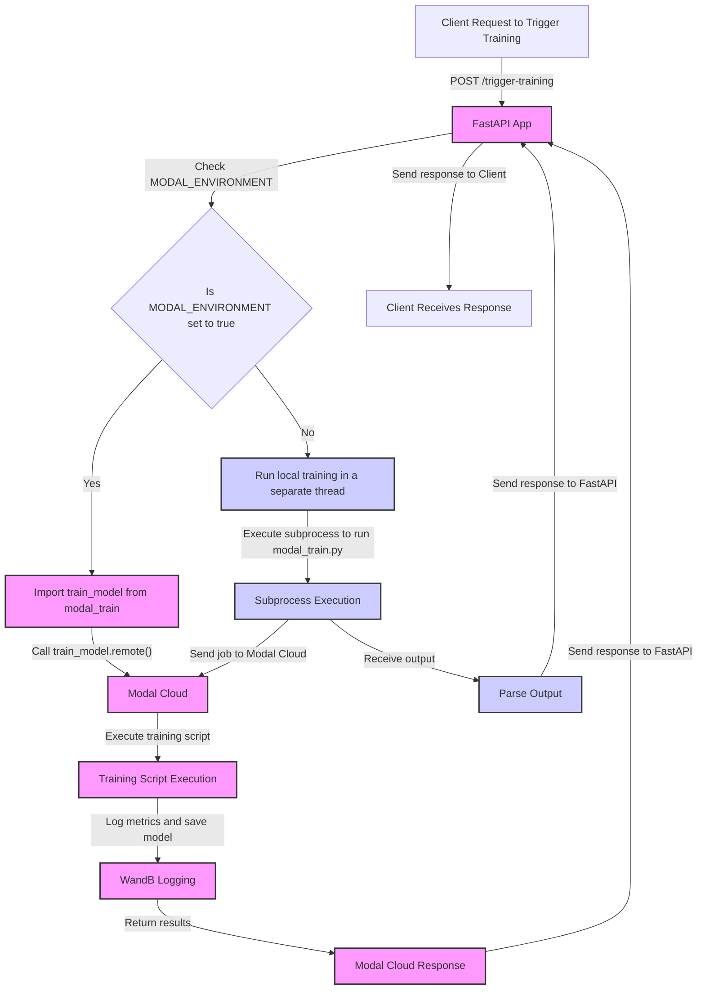

# mlops_simple_training
Simple project training with modal
Step-by-Step Guide:

1. Set up your environment:
```bash
# Create a new directory for your project
mkdir modal-wandb-training
cd modal-wandb-training
# Create a virtual environment
python -m venv venv
# Activate the virtual environment
# On Windows:
venv\Scripts\activate
# On macOS and Linux:
source venv/bin/activate
# Install required packages
pip install modal fastapi uvicorn scikit-learn wandb
```

2. Set up Weights & Biases:
   - Sign up for a Weights & Biases account at https://wandb.ai if you haven't already.
   - Get your API key from your W&B account settings.

3. Set up Modal:
   - Sign up for a Modal account at https://modal.com if you haven't already.
   - Install the Modal CLI:
```sh
pip install modal
```
   - Authenticate with Modal:
```sh
modal token new
```

4. Create a Modal secret for your W&B API key:
```sh
modal secret create my-wandb-secret WANDB_API_KEY=your_wandb_api_key_here
```

5. Create the Modal training script:
   Create a file named `modal_train.py` with the content from the "modal-wandb-training-function" artifact I provided earlier.

6. Create the FastAPI application:
   Create a file named `app.py` with the content from the "fastapi-training-trigger" artifact I provided earlier.

7. Deploy the Modal function:
```sh
modal deploy modal_train.py
```

8. Deploy the FastAPI application:
```sh
modal deploy app.py
```

9. Test your deployment:
   - Modal will provide you with a URL for your deployed FastAPI application.
   - Send a POST request to this URL with the "/trigger-training" path. You can use curl or a tool like Postman:
```sh
curl -X POST https://your-modal-url.modal.run/trigger-training
```

10. Monitor your training:
    - Log into your Weights & Biases account.
    - You should see a new project named "sklearn-modal-demo" with a new run.
    - You can view the logged accuracy and visualizations in the W&B dashboard.

11. (Optional) Local testing:
    If you want to test your FastAPI application locally before deploying:
    - Run the FastAPI app locally:
```sh
uvicorn app:app --reload
```
    - Send a POST request to the local server:
```sh
curl -X POST http://localhost:8000/trigger-training
```

12. (Optional) Customize and expand:
    - Modify the `train_model` function in `modal_train.py` to use your own dataset or a different model.
    - Add more endpoints to your FastAPI application in `app.py` for different types of training or data processing tasks.

Troubleshooting tips:
- If you encounter any issues with Modal, make sure you're logged in (`modal token new`) and that your `modal_train.py` file is in the correct directory.
- If you have issues with W&B, verify that your API key is correct and that you've set up the Modal secret correctly.
- For FastAPI issues, check the Modal logs for your deployed application to see any error messages.

Remember to keep your W&B API key and Modal credentials secure and never share them publicly.

This setup provides you with a web API that can trigger machine learning training jobs on demand, with the computation happening on Modal's infrastructure and the results being logged to Weights & Biases. You can expand on this basic structure to handle more complex models, datasets, and workflows as needed.


